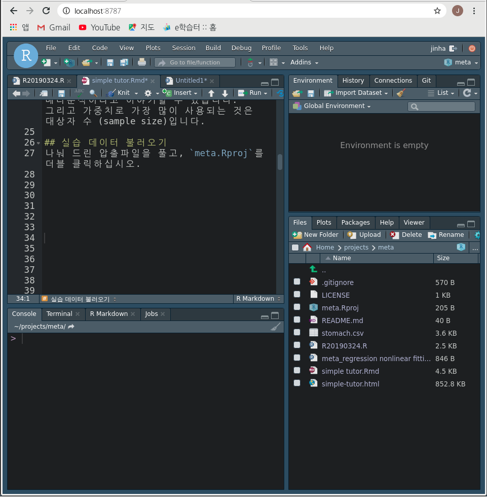

## 주의 사항 및 강의 목적
메타분석은 체계적 문헌 고찰을 전제로 하고 있습니다. 본 발표에서는 체계적 문헌 고찰 이후 데이터가 모였을 경우 메타분석을 어떻게 시행하는지에 대한 내용입니다. 또한 개념 파악을 중심으로 진행하며, 여러 오류에 대한 내용은 다루지 않습니다. 
강의 목적은 향후 CDM 으로 데이터가 산출 되었을 때 어떻게 내용을 병합할지 계획하기 위해 메타분석의 기본 개념을 익히는 데 있습니다. 

## 메타분석 기본 개념
`4 + 6`의 평균은 얼마인가요? 당연히 `(4+6)/2 = 5` 입니다. 여기서 4가 하나, 6이 하나 있기 때문에 나누기 2를 한 것입니다. 
만약 `4`가 9개고 `6`이 1개이면 어떤가요? `(4 * 9 + 6 * 1)/(9 + 1)` =`r (4 * 9 + 6 * 1)/(9 + 1)` 입니다. 즉 갯수가 많은 쪽으로 평균이 바뀌게 됩니다. 당연하지요.
여기서 첫번째 개념은 무언가의 대표값을 나타낼때 (그게 평균이라면)) 갯수가 많은 쪽으로 가중치를 주어서 표현할 수 있다는 것입니다. 
 비교위험도(Odds Ratio, OR)의 크기가 어떤 A 연구에서는 `4`이고 어떤 B 연구에서는 `6`라면 두 연구의 결과를 합하면 어떨까요?
 `(4 +6)/2`로 할 수 있을 까요? 이때도 가중치를 생각할 필요가 있습니다. 
 이번에는 가중치로 각 연구에 참여했던 연구 대상자 수를 생각해 보겠습니다. 만약 숫자적으로 A가 9명으로 B가 1명으로 연구한 것이라면 위의 `4+6`의 예처럼 `4`에 가까운 대표값이 나올 것입니다. 즉 대상자가 많은 A 연구 결과에 가까운 대표값이 나오게 됩니다.  이렇게 각 연구의 값을 연구들의 가중치를 고려하여 계산하여 대표값을 산출하는 것이 메타분석이라고 이야기할 수 있습니다. 그리고 가중치로 가장 많이 사용되는 것은 대상자 수 (sample size)입니다. Standard Error (SE) 가 sample size 의 제곱근의 반비례 하는데 따라서 1/SE를 자주 사용합니다.

## 실습 데이터 불러오기
나눠 드린 압출파일을 풀고, `meta.Rproj`를 더블 클릭하십시오. 그러면 아래와 같은 화면이 표시될 것 입니다.

`stomach.csv`라는 파일이 보일 것 입니다. 이 파일을 불러오겠습니다. 

```{r}
mm<-read.csv("stomach.csv")
mm <-mm[, 1:9]
```
데이터의 구조를 보겠습니다.
```{r}
library(kableExtra)
kable(mm[1:5,]) %>% kable_styling()
```
저자, 나라, 출판년도, 직종, 직종번호, OR|RR, lower limit, upper limit 이 있습니다. 이를 이용해서 meta analysis를 해보겠습니다.
본 연구의 목적은 분진 노출자와 위암 발생률의 메타분석입니다. 그리고 여기서는 OR|RR을 구분하지 않고 RR로 생각해서 분석해 보겠습니다.

## Data step
필요한 packages 를 불러옵니다. 
```{r, message=F}
library(dslabs)
library(tidyverse)
library(metafor)
```

위 데이터에서 `SE` 를 구해서 가중치로 사용할 것 입니다. Upper limit 은 OR + 1.96 * SE 이니까, 이를 이용해서 SE를 구합니다. 다만 Exp(Beta) = OR 이므로 log를 이용해 SE를 구합니다. 
`log(UL) =log(OR)+1.96 *SE --> SE = (log(UL) - log (OR))/1.96`
(mm데이터에 esT가 factor이네요 numberic으로 바꾸겠습니다.)
```{r}
mm <- mm %>% 
  mutate(lnesR=log(esR)) %>%
  mutate(se=(log(ul)-log(esR))/1.96)
```

## 기초 분석
`metafor` packages에서 effect Size (OR|RR)과 SE 그리고 데이터를 지정하고, `fixed effect|random effect`를 고려합니다. fixed effect 는 가중치를 1/se 로 random effect는 1/(se^2 + v) 를 이요합니다. 간단히 설명하면 이질성이 크면 random effect로 가중치를 v 만큰 보정해 준다는 것입니다. 아래 결과에서 이질성 검정의 P value를 보고 판단하면 됩니다.[참고: df=31일때 Chisq 값은 44.9입니다. 그런데 Q 값이 85로 크게 나왔네요 이러면 이질성이 있는 것입니다.]

```{r}
res <-rma(yi=lnesR, sei=se, measure="RR", digits=1, data=mm)
summary(res)
```
각 스터디의 요약값과 가중치를 고려해서 합한 값을 그림으로 봅니다. Randome Effect model로 1.31 (1.19-1.44) 로 나왔네요.
```{r}
forest(res, digits=2, atransf=exp)
```

## 오류 발견 및 수정
퍼블리케이션 바이어스는 출판 논문의 대칭성을 봅니다.  우선 아래 그림을 보면
```{r}
funnel(res)
```
이를 다시 그려보겠습니다. 이질성이 증가했습니다. 그리고 빈 동그라미가 생겼습니다. 만약 대칭성이 있었다면 빈 동그라미에 해댱하는 논문이 있었어야 하는데 없다는 뜻입니다. 
```{r}
rtf <-trimfill(res)
rtf
funnel(rtf)
```
통계적으로 대칭적인지도 살펴 봅니다. 크게 이상이 없네요.
```{r}
regtest(res, model="lm")
```

### 직종 보정해 보기
이질성이 있는 이유를 생각해보면 직종이 달라서 일 수 있습니다. 

```{r}
res2 <-rma(yi=lnesR, sei=se, measure="RR",mods=cbind(jt),  data=mm)
res2
```

```{r}
forest(res2, digits=2, atransf=exp)
```
각 직종별로 보면 어떤 직종이 가장 위험도가 높은가요? 
일반적으로 높은 농도에 노출되는 직종에서 위암 위험도가 높다고 할 수 있을까요?
```{r}
tt<-predict(res2, newmods=cbind(seq(from=1, to=5, by=1)), transf=exp, addx=TRUE)
tt %>% kable() %>% kable_styling()
```

이를 그림으로 그려 보겠습니다.
```{r, message=FALSE, warning=FALSE}
preds <- predict(res2, newmods = cbind(1:5), transf = exp)
jtp<-c(1:5)
pp<-cbind(jtp, data.frame(preds))
wi<-1/(mm$se^2)
size <- 5 + 10 * (wi - min(wi))/(max(wi) - min(wi))

plot(mm$jt, exp(mm$lnesR), pch = 19 ,col = alpha(blues9, 0.4), cex = size/2, 
     xlab = "Occupation", ylab = "Relative Risk",
     las = 1, bty = "l", log = "y", xlim=c(1,5.5))
lines(1:5, preds$pred, lwd=2, col='grey')
lines(1:5, preds$ci.lb, lty = "dashed")
lines(1:5, preds$ci.ub, lty = "dashed")
abline(h = 1, lty = "dotted")

```


